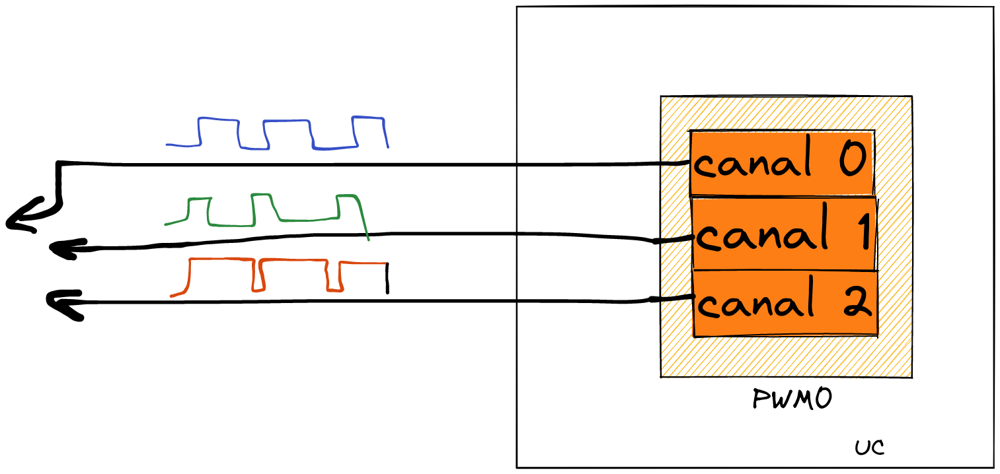
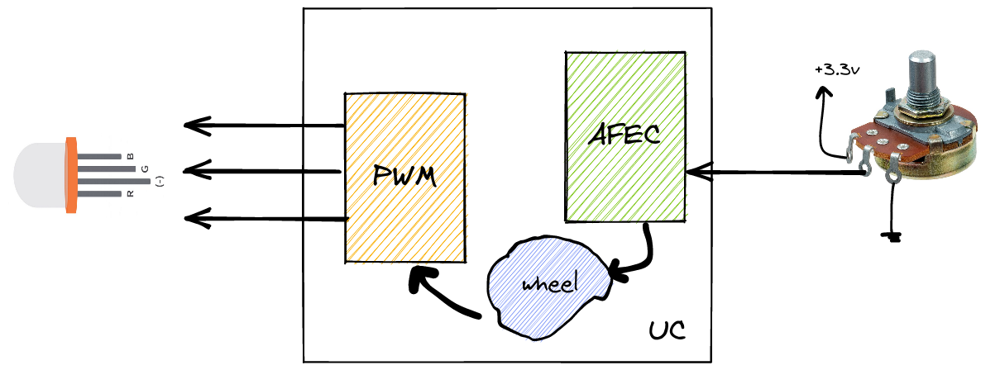
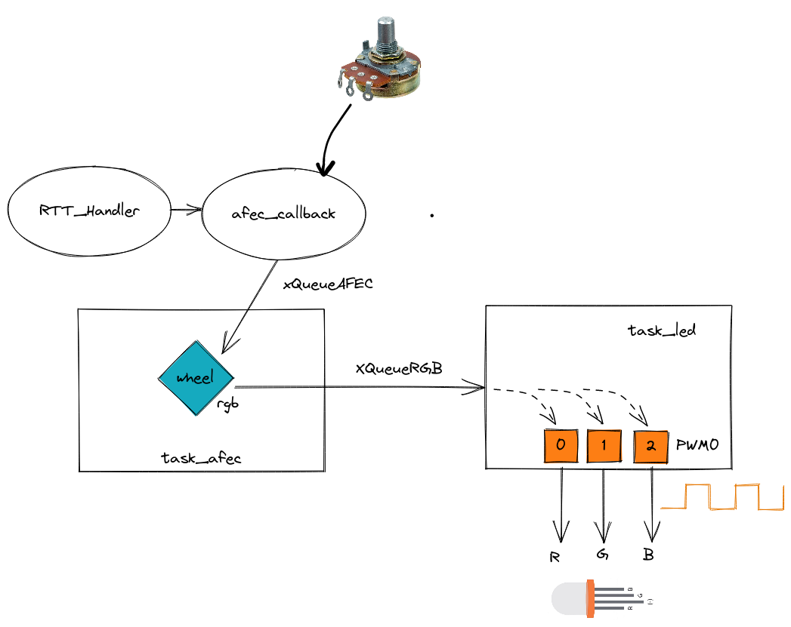

# 22b - AV2 - LED RGB

> LEIA TODOS OS PASSOS ANTES DE SAIR FAZENDO, TENHA UMA VISÃO GERAL DO TODO ANTES DE COMECAR.

Nesta avaliação vocês irão criar firmware que aciona um LED RGB de acordo com o valor de um potenciômetro. 

## Descricão

Periféricos:

- PIO
- AFEC
- RTT
- PWM (novo)

freeRTOS:

- Task
- Queue

Componentes:

- LED RGB Catodo comum
- Potenciômetro

### O que é um LED RGB?

É um componente eletrônico que possui internamente três LEDs nas cores VERMELHO (R), VERDE (G) e AZUL (B), com este componente conseguimos gerar várias cores e indicar com apenas um LED vários estados de um dispositivo (que possui uma interface homem máquina limitada).


Existem dois tipos de LED RGB: catodo comum e anodo comum, o catodo comum se refere ao led que o catodo (a parte que a corrente elétrica sai) é comum para todos, ou seja, o terra é comum:


### PWM

Para controlar o LED RGB e conseguir criar uma cor que é composta por RGB de forma granular (um pouco de vermelho, um bocado de verde e bastante azul), devemos conseguir controlar a intensidade de cada uma das cores do LED, e isso é feito com um PWM! (sim aquele de acionamentos).

O pulse width modulation (PWM) é uma modulacão que altera uma onda quadrada, definindo o tempo que o sinal fica em nível alto (duty cycle), quanto mais tempo o sinal ficar em nível alto (1), maior será a tensão média no pino, quanto mais tempo em baixo, menor será a tensão média no pino.


### Periférico PWM

O nosso microcontrolador possui dois periféricos PWM (`PWM0` e `PWM1`) que uma vez configurados conseguem gerar uma onda quadrada em um pino escolhido e ajustar o valor do duty cycle. Cada PWM possui quatro canais que operam com duty cycle independente o que irá possibilitar controlarmos a intensidade de cada uma das cores do LED:



### AFEC

Na entrega vocês devem utilizar o AFEC para definir qual cor será exibida no LED (mais para frente eu vou detalhar), mas vamos definir uma função (`wheel`) que relaciona o valor do potenciômetro com as cores do LED.



## Entrega

### Funcionalidade

A entrega deve ser um sistema embarcado que aciona um LED RGB com três PWMs usando como base a leitura de um valor analógico via AFEC.

[](https://youtu.be/4Q7mcvLPfJ4)

### Firmware

Vocês devem desenvolver o firmware como indicado a seguir:



- **O código base fornecido é o `RTOS-OLED-Xplained-Pro` já com o RTT e com o PWM adicionados no wizard. As funções PWM_init(), RTT_init() declaradas, e a função wheel() pronta para ser implementada**

Onde:

- `RTT_Handler`:
  - Deve gerar uma frequência de 10Hz para inicializar a conversão do AFEC (`afec_start_software_conversion(AFEC_...)`
  
- `afec_callback`:
  - Função de callback do afec que indica que o valor está pronto, deve enviar o valor lido para a fila `xQueueAFEC`
  
- `xQueueAFEC`:
  - Fila de inteiro (uint) para envio dos dados lidos do potenciômetro.
  
- `task_afec`
    - Configura o RTT em 10Hz 
    - Possui uma fila `xQueueAFEC` para recebimento do valor analógico convertido
    - Chama a função `wheel` para converter um inteiro do AFEC em `RGB`
    - Envia o valor `RGB` para a `task_led` via a fila `xQueueRGB`
    
- `xQueueRGB` 
    - Fila que possibilita o envio e recebimento do valor RGB
    - A fila deve ser de uma `struct` que possibilita enviar o **RGB**
    
  - `task_led`
    - Configura os três pinos para operar com PWM0
    - Configura os canais (`0`, `1` e `2`) do PWM0
    - recebe um dado na fila `xQueueRGB` e altera o duty cycle de cada PWM de acordo com o valor recebido
    
- `whell`
    - Função que converte um valor analógico (0..255) em RGB (0..255, 0..255, 0..255)
    - Use como base a seguinte função extraída de um código do arduino:
 
    ```c
    // Input a value 0 to 255 to get a color value.
    // The colours are a transition r - g - b - back to r.
    uint32_t Wheel( byte WheelPos ) {
      WheelPos = 255 - WheelPos;

      if ( WheelPos < 85 ) {
        setColor( 255 - WheelPos * 3, 0, WheelPos * 3 );
      } else if( WheelPos < 170 ) {
        WheelPos -= 85;
        setColor( 0, WheelPos * 3, 255 - WheelPos * 3 );
      } else {
        WheelPos -= 170;
        setColor( WheelPos * 3, 255 - WheelPos * 3, 0 );
      }
    }
    ```
 
    - Note que o input da função é um byte, ou seja, de `0..255` e o nosso analógico é um valor de `0..4095`
    - Não possuímos a função  `setColor(char, r, char g, char b)`, a nossa função `wheel` deve retornar o RGB para enviarmos para a fila.
    - A função deve possuir a seguinte prototipacacao `void wheel( uint WheelPos, uint8_t *r, uint8_t *g, uint8_t *b )`
    - **DICA: no código já tem a função definida, você precisa apenas implementar.**

### Por onde comećar?

LEIA TODOS OS PASSOS ANTES DE SAIR FAZENDO, TENHA UMA VISÃO GERAL DO TODO ANTES DE COMECAR.

1. Você vai precisar entender como o PWM funciona, para isso temos um exemplo fresquinho no `SAME70-examples/Perifericos-uC/PWM-LED/`.
   - Leia o exemplo, entenda o código, execute o exemplo.
   - **Já use o LED RGB no exemplo do PWM, escolha uma das cores para testar o exemplo**.
   
1. No repositório da AV2, crie a `task_led` e incorpore o exemplo recém executado.
   - Lembre de validar!

1. No final do README do PWM tem uma explicacão de como configurar outro pino para funcionar com PWM canal 1.
   - Conecte outra cor do LED RGB e faća ele ser controlado por outro PWM.
   
1. Agora você só precisa de mais um pino PWM, mas é por sua conta de como fazer.
   - No README do PWM tem como escolher outro pino
   - Conecte a cor restante e faca ela funcionar com um novo PWM, use o canal 2 do PWM0
   - **IMPORTANTE: NÃO USE O PINO PB4**, pois ele é o mesmo da UART

1. Parta para a `task_afec`, configure o RTT, AFEC, envio da leitura para a fila `xQueueAFEC`

1. Converta o valor do AFEC de `0..4095` para `0..255` (o wheel recebe um char!)

1. Implemente a função `void wheel( uint WheelPos, uint8_t *r, uint8_t *g, uint8_t *b )`
   - Se quiser debugar, printf ajuda!

1. Chame a função `wheel` passando o valor do AFEC já corrigido para `0..255`.
   - Imprima no terminal os valores convertidos de RGB para validar!

1. Crie a fila `xQueueRGB` e faća o envio do valor `RGB` para a fila
   - Note que você precisa enviar os valores de RGB, use uma fila de struct para isso!

1. Na `task_led` leia o valor que está chegando na fila e configure cada um dos canais do `PWM` para acionar o duty cycle recebido.

## Rubrica

- [ ] LED varia de acordo com potenciômetro respeitando a função `wheel` (gradual do vermelho, passando pelo roxo, azul, verde, amarelo, vermelho)
- [ ] `task_afec` e `task_led` implementadas
- [ ] RTT para dar a frequência de amostragem do AFEC (10Hz)
- [ ] `wheel` implementado e sendo usado na `task_afec`
- [ ] `xQueueAFEC` e `xQueueRGB` usados para enviar dados (conversaor e RGB)
